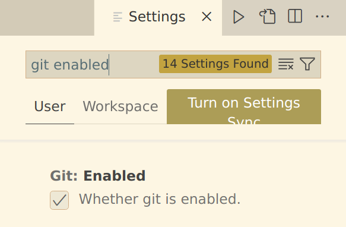
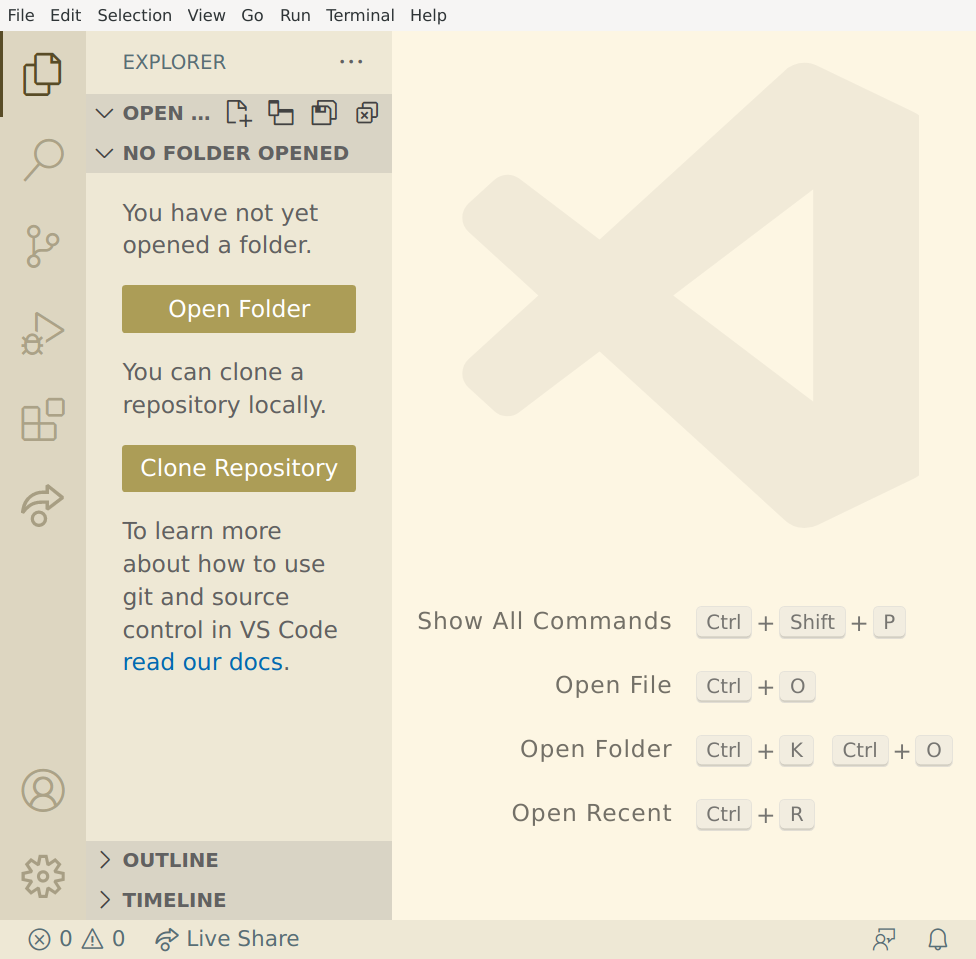
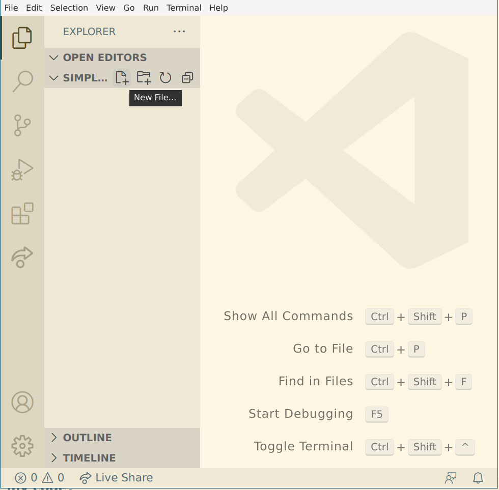
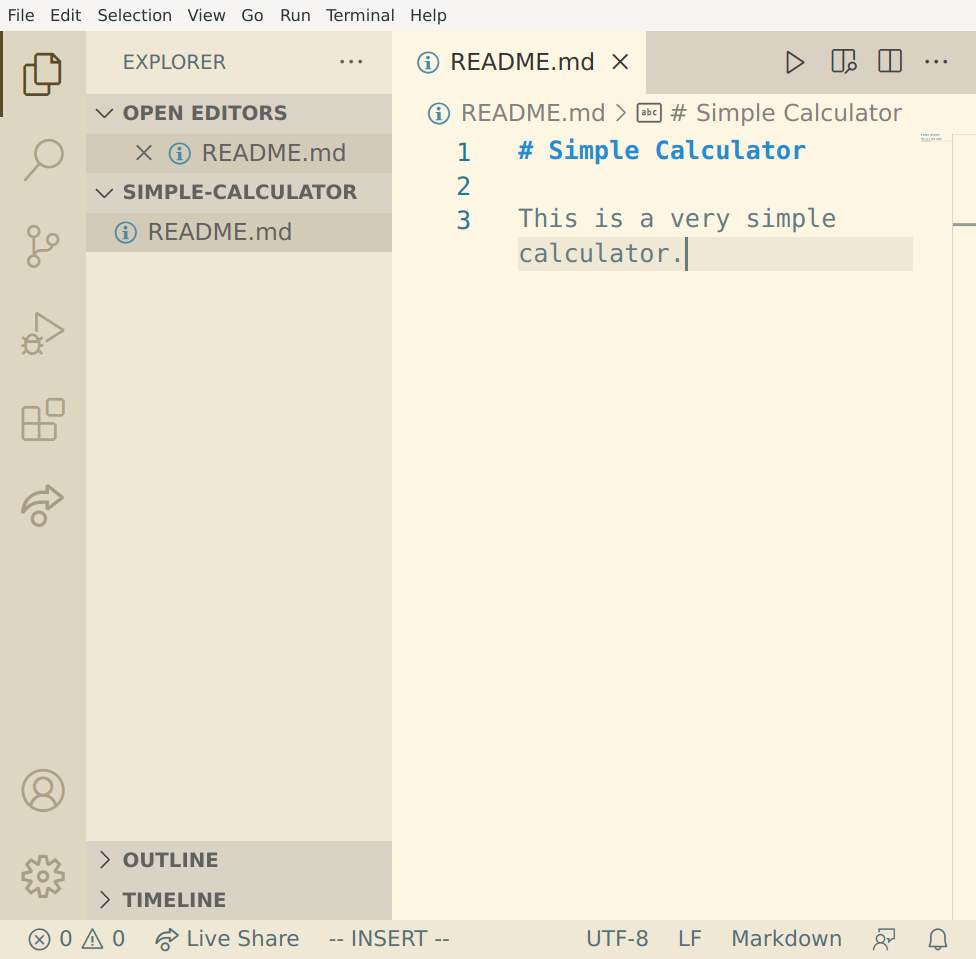
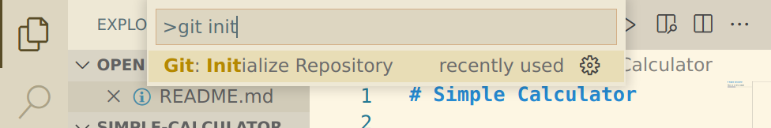
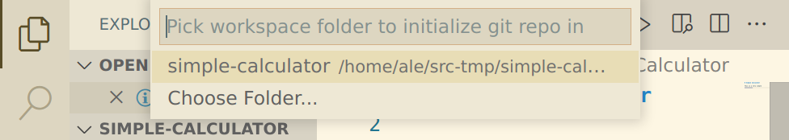
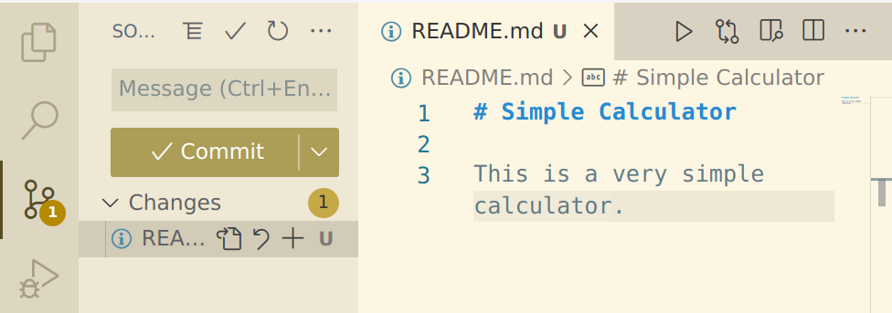
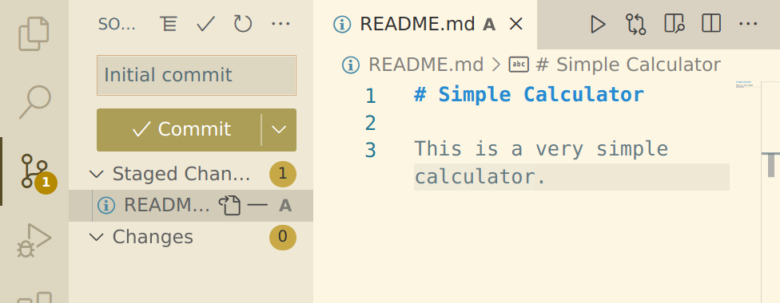

# An introduction to Git

Welcome to this introduction to Git for people who are learning programming.

In this course you will learn:

- What is Git.
- What is version control.
- How to use Git from a [code editor](https://en.wikipedia.org/wiki/Source-code_editor) (with little references to the terminal) to manage your code.
- How to use one of the common platforms for Git for your projects (three of them will be mentioned: Github, Gitlab, Gitea).
- How to contribute to other people projects (or let other people contribute to your projects)

The course is composed of two modules of two hours:

- The first module goes through the setup of Git and the basic usage of Git.  
- The second one is mostly about using Git to collaborate with other people.


## Table of contents

<!-- toc -->
- [Table of contents](#table-of-contents)
- [Introduction](#introduction)
- [Setting up Git](#setting-up-git)
  - [Linux](#linux)
  - [Windows](#windows)
  - [MacOs](#macos)
- [Setting up a GUI: Visual Studio Code](#setting-up-a-gui-visual-studio-code)
  - [Set up the Git environment](#set-up-the-git-environment)
- [Some basic concepts](#some-basic-concepts)
- [Create a new project and track it with Git](#create-a-new-project-and-track-it-with-git)
  - [In the terminal](#in-the-terminal)
  - [Using Git for existing projects](#using-git-for-existing-projects)
- [An exercise: adding code to your repository](#an-exercise-adding-code-to-your-repository)
- [Bits and bytes](#bits-and-bytes)
  - [The `README.md` file](#the-readmemd-file)
  - [Save vs. commit](#save-vs-commit)
  - [`.gitignore`](#gitignore)
  - [Managing the dependencies](#managing-the-dependencies)
- [Notes](#notes)
<!-- /toc -->

## Introduction

Git is a tool for managing the source code you write.

What you need:

- A laptop where you have the rights to install software.
- If possible, [Visual Studio Code]() installed on your computer (you can use another IDE or source code editor you already feel comfortable with, but you will need to slightly adapt the instructions).
- If you have a Mac, you should [install Xcode](https://developer.apple.com/xcode/resources/)

## Setting up Git

### Linux

First you can check if Git is already installed by opening a terminal window and typing:

```sh
git --version
```

If you get something like

```
git version 2.35.1
```

then Git is already installed.

If you get, an error, you can use your package manager to install the `git` package.

As an example, on Debian and Ubuntu you can use the terminal to install Git:

```sh
sudo apt update
sudo apt instal git
```

### Windows

If Git is already installed, you should be able to find `Git Bash` in your program launcher.

If it's not installed, download the version of Git matching your system (probably the _64-bit Git for Windows Setup_. from <https://git-scm.com/download/win> and install it.

Please, install Git in the default location, the one suggested by the installer.

### MacOs

On Mac computers, Git might already be installed.

If it's not the case, <https://git-scm.com/download/mac> lists a few ways for installing Git on a Mac. We suggest to:

- Install it along to Xcode.  
  This is the way we recommend: if you want to program with your Mac computer, your probably need to install Xcode anyway.
- Install it with Homebrew, if you're already using Homebrew. 

## Setting up a GUI: Visual Studio Code

Git is a command line tool that runs in the terminal.

Sometimes there is no way around using the terminal to access the full power of Git, but most people use a GUI for Git during their daily coding work.

In this tutorial, we will be using Visual Studio Code and its built in Git features (most IDEs will work in a similar way: you're welcome to use your preferred editor, if you think you can follow the tutorial with it).

In _File > Preferences_ (or _Code > Preferences_ on a Mac): type _Git enabled_ and make sure that the Git is enabled:

[](assets/vscode-git-enabled.png)  

### Set up the Git environment

`Terminal > New Terminal`

```sh
git config --global user.name "Your Name"
git config --global user.email "youremail@domain.com"
```

Two remarks:

- If you use Git to upload your code to a service like Github or Gitlab, by default, the value of `user.name` will be visible in each of your commits. If you're not comfortable with the idea of your identity being disclosed, you can use your first name only, or a nickname. Still, try not to be silly: keep in mind that a future employer might also be browsing your repositories...
- The email address should match the address you will be using to register for the Git services (Github, Gitlab, ...).  
If you don't want it to be publicly exposed, the Git services might provide anonymous addresses: in this case, you will need to change the value of `user.email` before doing any commit that will be published in that service.

## Some basic concepts

- When you track a project with Git, all the information for the revision control is stored in a the hidden folder `.git` that Git creates at the root of your project.
- You don't need any external service or the internet to use Git: all the revision information about your project is stored on each computer that has a copy of it.
- You will often hear that Git is not Github. Even if Git can indeed work without a central server, it's very likely that you will want to use a service (like Github or Gitlab) to share the Code among Computers and / or users.
- Git has been created by Linus Torvalds for managing the Linux source code. And the Linux code is managed without any web based platform: patches are exchanged through mails sent to the kernel mailing list.

## Create a new project and track it with Git

Now that Git is installed and configured, we can learn how to use it for a tiny project by creating a very simple calculator.  

First we need to create a new project and add a first file (the Readme) to it:

- Start a new Visual Studio Code window  
  [](assets/vscode-empty.png)  
  If you already have any projects open, _File > New Window_ will give you... an new window.
- Click on the _Open Folder_ button in the Explorer left panel, create a new folder called `simple-calculator` in the folder where you normally put your code, and open it.
- Tell Visual Studio Code, that you trust the folder (you have created it!) and enable all features.
- Put your mouse on the _SIMPLE-CALCULATOR_ section of the _Explorer_ left panel, and click on the _New File_ icon to create the `README.md` file.  
  [](assets/vscode-newfile.png)  
- Fill the `README.md` with a first description of the project:  
  [](assets/vscode-readme.png)  

> ### Where should I put my code?
>
> As soon as you start relying on  Git for version control, you should probably avoid to put your code in folders that are in your backup plans or otherwise synchronized with the Cloud.  
> A good solution is to create a new _Code_ folder next to your _Documents_ folder.

Time to initialize the repository and add the existing file to it:

- With _ctrl-shift-p_ (or _Help > Show All Commands_), start the _Command Launcher_ and type _git init_.  
  [](assets/vscode-git-init.png)  
- Pick the command _Git: Initialize Repository_.  
- Pick the _simple-calculator_ workspace.  
  [](assets/vscode-git-init-workspace.png)
- If the repository has been correctly created, you should see a fat black __U__ next to the `README.md` file: if you put the mouse cursor on the __U__ you will learn that it means _untracked_.
- If you switch to the _Source Control_ left panel, you will see a big _+_ appear on the `README.md`: if you click on it, the file will be staged, which in this specific case means that the file should be added (in its current state) with the next commit.  
  [](assets/vscode-git-stage.png)
- The `README.md` file now gets an __A__ (_Added_, of course): type _Initial commit_ as the commit message at the top of the _Source Control_ panel and and your're ready to click on the _✓ Commit_ button to finally add the `README.md` file ­– with its current content – to the Git repository.  
  [](assets/vscode-git-commit.png)
- In the _Source Control_ left panel, you should now see the _Publish Branch_ button, and if you switch back to the _Explorer_ panel, there should be no __U__ or __A__ next to the `README.md` file: your repository is clean.

### In the terminal

We have made the first steps with Git by using the interface provided by Visual Studio Code: this is very close to what you will be using for your programming whatever environment you will be using.

Many Git tutorials teach how to use the terminal. Here is also the summary of this chapter, in a few commands:

```sh
ale:~$ cd Code
ale:~/Code$ mkdir simple-calculator
ale:~/Code$ cd simple-calculator
ale:~/Code/simple-calulator$ echo "# Simple Calculator\n\nThis is a very simple calculator" > README.md
ale:~/Code/simple-calulator$ git init
ale:~/Code/simple-calulator$ git add README.md
ale:~/Code/simple-calulator$ git commit -m "Initial commit"
```

You're welcome to dive into it and try out the commands! But no need to fall in dispair, if you don't understand everything.

Honestly, for your first steps and for your daily programming, you're probably better off with a GUI. But the few times you need to do some _magic_, it's likely that you will need to fall back on the terminal.

> ### Git can be hard... but it won't let you down
>
> Git is a complex Revision Control System and it's very likely that there will be a solution each time you have broken it.
> But there are good chances that you will have to type some _black magic_ in the terminal.  
> Don't be shy of searching the internet for solutions, but make sure that you understand what the command you type is supposed to do!  
> And if you're not 100% sure of what could happen, you might want do a backup of your project (including the `.git` hidden folder) before running the command.

### Using Git for existing projects

Of course, you can also use Git for projects that you have already started: just follow the above steps, but instead of creating a new folder:

- Open the existing folder.
- _ctrl-shift-p_ and _git init_
- Add the files and folders to be tracked (we will see later which files should not be tracked)

Even more important, one of the main goals of Git is to allow you to participate to existing projects.  
In the second module of this tutorial, you will learn how to pull the existing code of a project that is versioned with Git and how to contribute back your changes.  
If a specific project does not use Git but another Version Control System (like [SVN, Mercurial, or Fossil](https://en.wikipedia.org/wiki/List_of_version-control_software)) it's likely that the basic concepts will be similar to the ones you're learning in this tutorial. In such cases, don't insist in using Git, just use what the projet is using.

## An exercise: adding code to your repository

- In your project create a folder for the code. You can name it `src`, `source`, `code`, but the best one is probably the name of the project, in our case `simple-calculator`.
- In the new folder, add the main file for your code (`main.py`, `main.dart`, `main.cpp`, `index.js`, `index.php`, ...) and add some code in it to do a calculation (something like `print(2 + 3)`).
- With the _Source Control_ left panel, add the file to your repository and commit the changes (press on the __A__ next to the file name, write a commit message, and press on the _Commit_ button).
- In group of two, look at each other other code and give a next task to the other person.
- When you have completed the task the other person gave you, commit the changes.

> ### The commit history
>
> In the _Explorer_ pane, you can open the _TIMELINE_ section and you will see the history (log) of your commits.
>
> You can click on each commit and see the changes it contains.

## Bits and bytes

### The `README.md` file

Always put a `README.md` file in the root folder of your project.

In the `README.md` file, you should at least write a short description of your project.

You might also want to put in there some notes about the choices you made (which library you did use or did not use, ...), links to the resources you are using (tutorials, similar projects, assets, ...), ...

You might want to add further `README.md` files in other folders of your project. As an example you could create one in the `assets/` folder and list there the links and license text for the assets you are using.

Some Git tool (like the Github and Gitlab websites) will show you the content of the `README.md` file, when you get into the project or the folder.

### Save vs. commit

Why do you need to commit a file, when you already have saved it? What's the difference?

When you're writing a program, you need to save your code before you can run and test it.  
There are good chances that the code will now work or not work as you expected. You will then modify and save it again until you're happy with it.

When you're task is completed, you've made a step in your code, you can commit your changes: the golden rule is to only commit code that works correctly and to commit as soon as it works (in the real world, we're often a bit lazy and people _sometimes_ commit multiple changes at once...).

### `.gitignore`

The `.gitignore` file at the root of your project contains a list of files that will be ignored by Git.

If you let a tool create your project (like `flutter create <project-name>`), there will be a `.gitignore` that fits well with that type of project.

### Managing the dependencies

In most cases, you will not want to add the dependencies to the Git repository.

This is even more true, if you're using a tool to manage your dependencies (pip, npm, composer, ...).

This means that you will add to `.gitignore` folders like  `venv` (Python), `node-modules` (Javascript), `vendor` (PHP) and add to Git the `requirements.txt` (Python), `packages.json` (Javascript), `composer.json` (Python) files.

For languages like C and C++ you might write in the `README.md` how to get the dependencies and were to store them.

## Notes

This tutorial is based on:

- http://opentechschool.github.io/social-coding/
- https://github.com/git-guides/git-init

Some useful links:

- [Using Git source control in VS Code](https://code.visualstudio.com/docs/sourcecontrol/overview)
- [How do I use Bash on Windows from the Visual Studio Code integrated terminal?](https://stackoverflow.com/questions/42606837/how-do-i-use-bash-on-windows-from-the-visual-studio-code-integrated-terminal)
- [Github: Setting your commit email address](https://docs.github.com/en/account-and-profile/setting-up-and-managing-your-personal-account-on-github/managing-email-preferences/setting-your-commit-email-address)