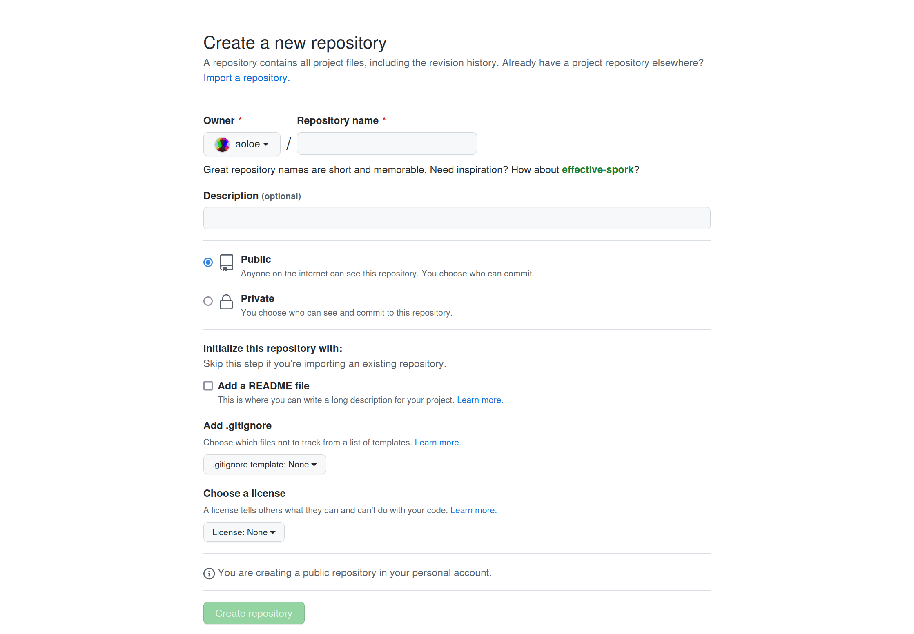
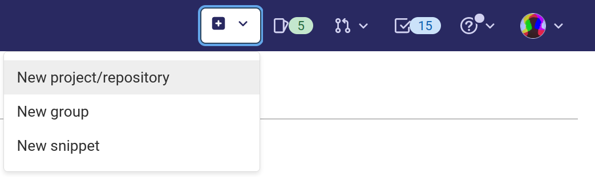
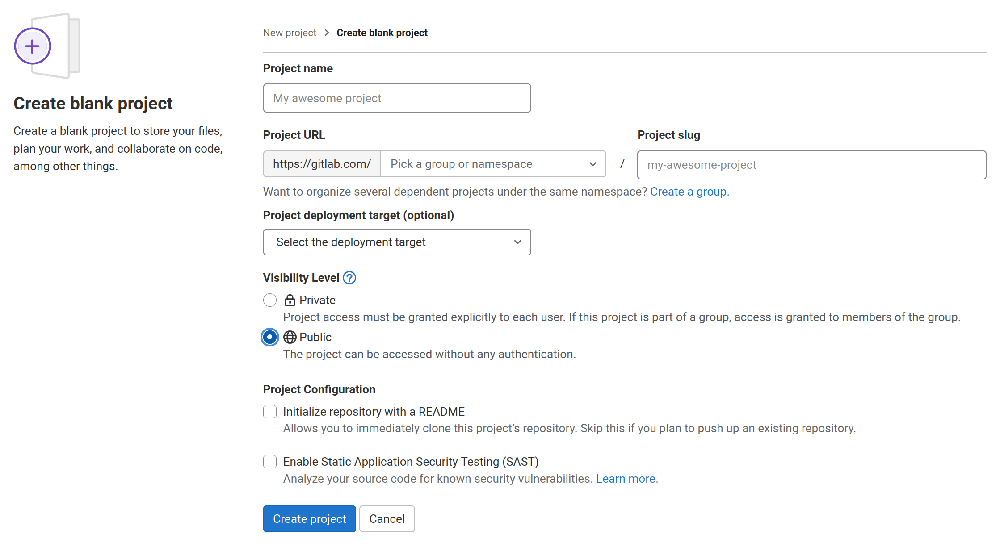
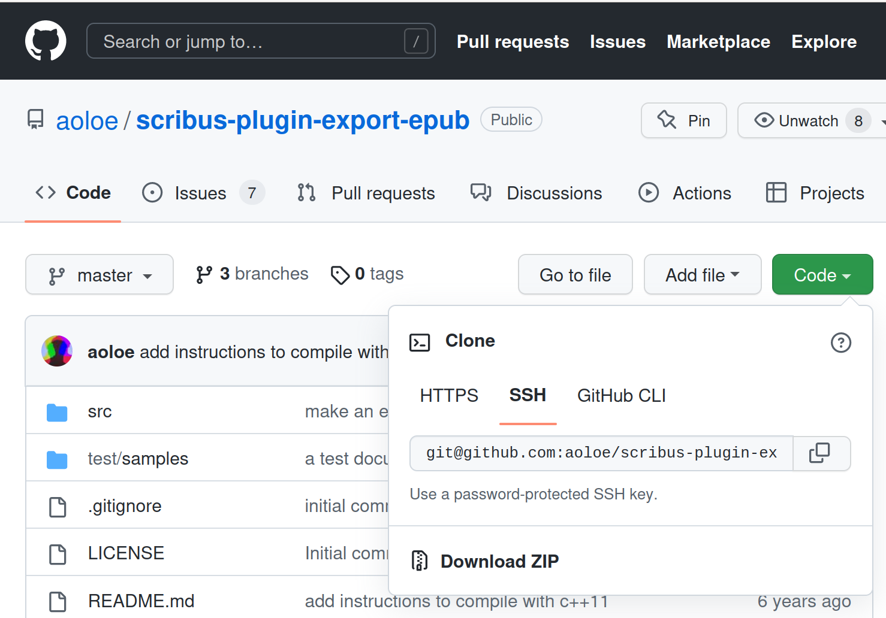
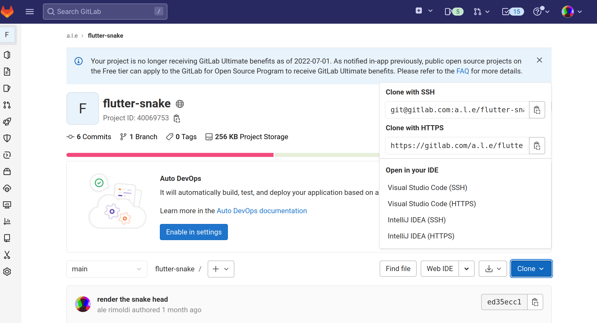
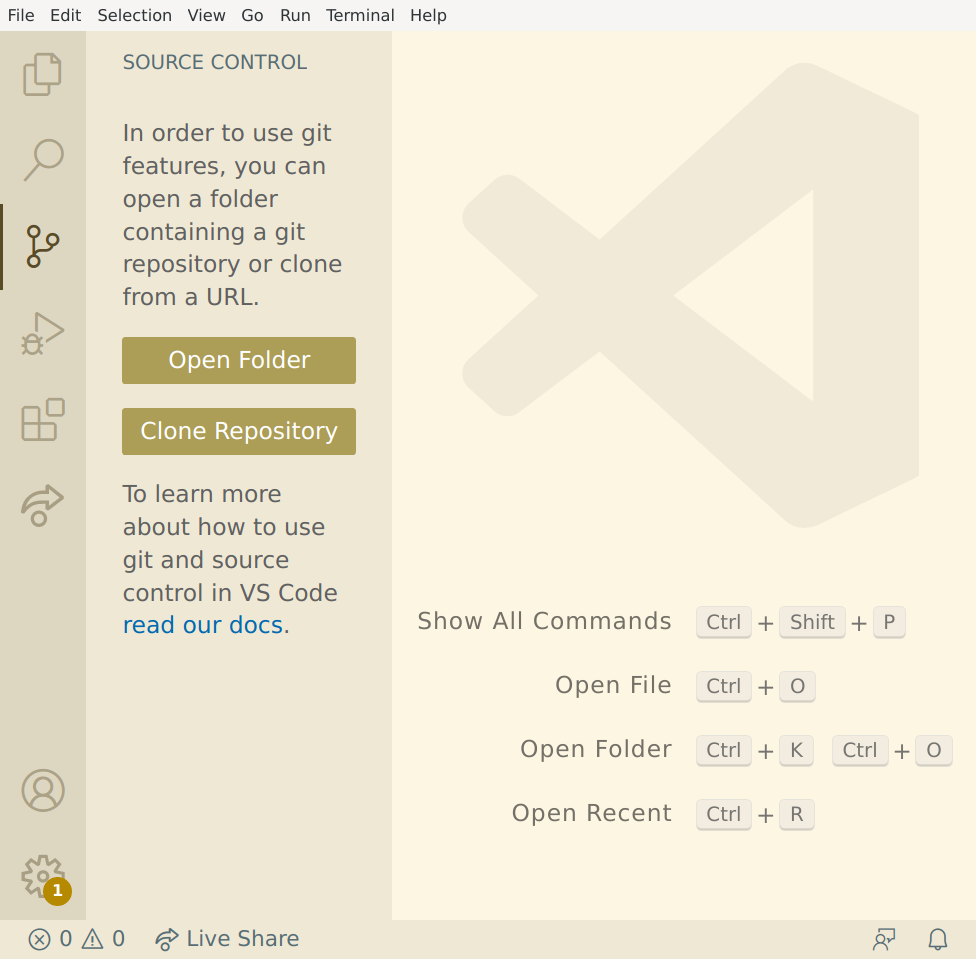
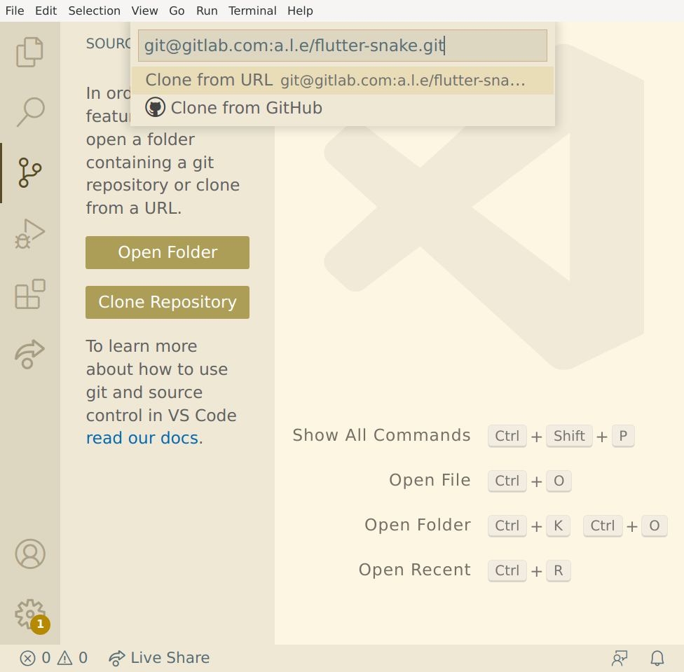
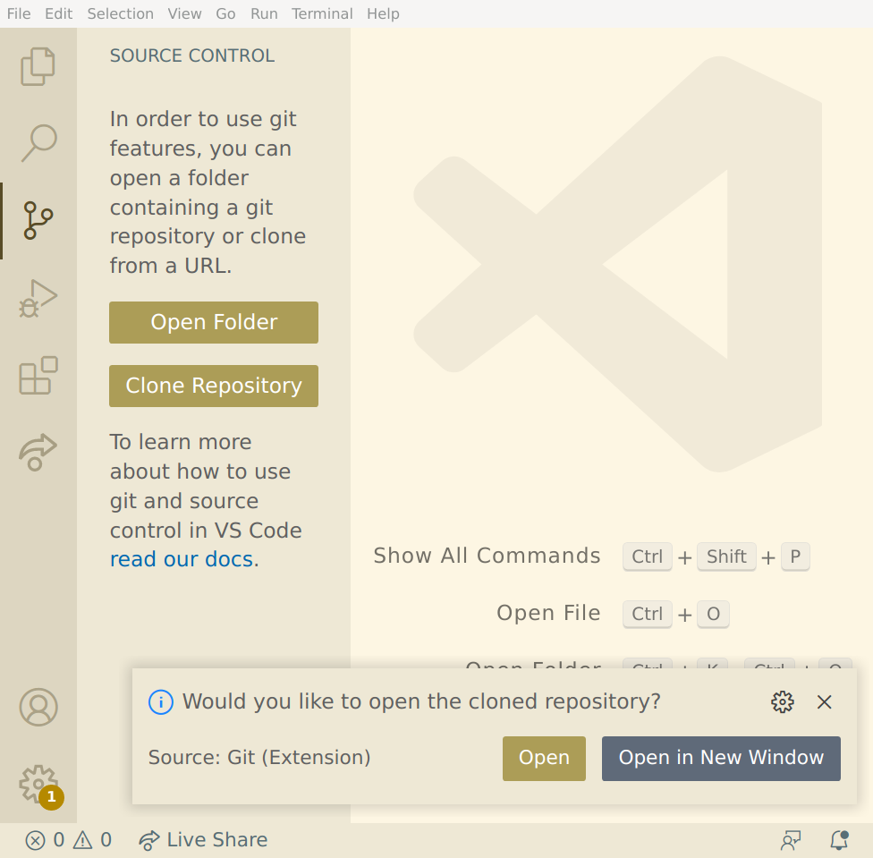
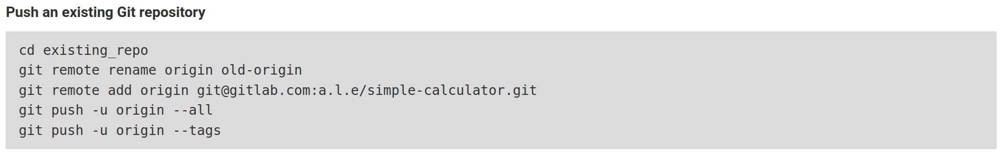

# An introduction to Github / Gitlab

Welcome to this introduction to Github / Gitlab for people who are learning programming.

This is the second part of the introduction to Git.  
If you don't know about Git, you should first go through the first part of this tutorial.

In this second two-hours-module you will learn how to collaborate with other people:

- How to use one of the common platforms for Git for your projects (three of them will be mentioned: Github, Gitlab, Gitea).
- How to contribute to other people projects (or let other people contribute to your projects)

In the same mood as in the first part of this tutorial, we will give a general introduction to the topic but focus on what is most commonly used. This means that we will mainly talk about the two platforms Github and Gitlab and we will use Visual Studio Code to manage the code.  
But you're welcome to use any other platform and software you are already comfortable with.


## Table of contents

<!-- toc -->
- [Hosting the source code repositories](#hosting-the-source-code-repositories)
- [The hosting platforms](#the-hosting-platforms)
- [Creating an account](#creating-an-account)
  - [Setup your account](#setup-your-account)
  - [Create the ssh keys](#create-the-ssh-keys)
- [Creating a project](#creating-a-project)
- [Editing the project online](#editing-the-project-online)
- [Cloning a project to your computer](#cloning-a-project-to-your-computer)
- [Pushing an existing project](#pushing-an-existing-project)
- [Forking and contributing to a project](#forking-and-contributing-to-a-project)
- [Syncing a fork](#syncing-a-fork)
- [Github](#github)
- [Git remote add upstream](#git-remote-add-upstream)
- [Other services for your project](#other-services-for-your-project)
- [Notes](#notes)
<!-- /toc -->

## Hosting the source code repositories

In the first part of this tutorial, we have learned the basics of Git and it's likely that it has fealt a bit strange to do it without Github.

It was probably not what you expected.

Even if most people have an hard time to see a difference between Git and Github:

- you can use Git without a platform like Github
- there are several other platforms for hosting the source code repositories.

But there is a reason why the second part of this workshop is called _An introduction to Github_:

- Hosting the repositories in the web helps for collaboration.
- People might get interested in your project and not only use it but also become contributors.
- Most of the existing platforms do more than host your code and 

If your project is open, it's seems obvious why you would want it to be hosted in a public space.  
But even for private projects (personal or for a company), it might be useful to have them hosted in a place that can be reached when you're connected to the internet (sharing with friends, clients, employees working from home, freelancers, clients, ...).

## The hosting platforms

At the time of writing, here are the most common hosting platforms:

- [Github](https://github.com): for the social network part of it.
- [GitLab](https://gitlab.com): the other big player, can be self hosted for free.
- [Bitbucket](https://bitbucket.org): from the vendors of Jira and Trello.
- [Sourcehut](https://sourcehut.org): a clean and simple interface; hacker's style and supports Mercurial.
- [Codeberg](https://codeberg.org): Free Software style; hosted in the EU.
- [Sourceforge](https://sourceforge.net): For the nostalgics. With SVN support.

You can of course install a Git platform in your local network:

- [Gitea](https://gitea.io): lightweight and simple to install.
- [Gitlab](https://gitlab.com): with all bells and wistles.
- [Gogs](https://gogs.io): lightweight and simple to install.

## Creating an account

Before your can host your projects, you need to create an account:

- For Github, go to <https::/github.com> and click on the _Sign up_ button in the top right corner.
- For Gitlab, go to <https://gitlab.com> and click on Login, then on the [Register now](https://gitlab.com/users/sign_up) link towards the end of the page (I'm not sure what the _Free trial_ button does...)

and follow the instructions and sign into the platform.

> ### The email address
>
> As said in the first part of this tutorial, you need to take care about which email address and name you're setting for Git and the related platforms: even if there are way to increase your privacy, you should be comfortable with the idea that they might be publically visible at some time or under certain circumstances.

### Setup your account

- on Gitlab you might need to setup a Group to be able to fork projects (just create a group with your username)... to be checked

### Create the ssh keys

You're used to identify to services by providing a username and a password.

When working with Git platforms it's advised to work with _keys_ insted of a password:

- It's tedious to type the password each time you want to push your code (ok, often you can get your system to store and provide the password...)
- Passwords tend to be too short to be secure enough.  
  Public repositories can be modified by anybody who can figure out your passord. On the other side, you (and other people, if your code gets famous) will download the code and run it on their computer without much protection: this makes it interesting to try to inject malicious code into random people code.  
  This is the main reason why, Git platforms tend to only provide a key based authentication.
- We will be creating and using a _ed25519_ key. Or, if your system does not support it, a 2048-bit RSA.

This is often seen as one of the _hardest_ steps, when setting up a Git workflow. the major Git platforms have already written good tutorials and we will refere to their instructions for setting up the SSH keys:

- [Generating a new SSH key and adding it to the ssh-agent](https://docs.github.com/en/authentication/connecting-to-github-with-ssh/generating-a-new-ssh-key-and-adding-it-to-the-ssh-agent) for Github
- [Use SSH keys to communicate with GitLab](https://docs.gitlab.com/ee/user/ssh.html)

In short:

- We are using the _standard_ tool SSH to create the keys.
- The keys will be in the _.ssh_ folder in your _home_ folder.
- At the end of the process, you have one private key that must be kept as a secret on your computer, and a public key that you can share with other people (like the Git service provider).
- This is called a [asymetric cryptography](https://en.wikipedia.org/wiki/Public-key_cryptography) (or public key cryptography)

## Creating a project

When starting a new project the most simple way is to first create a project in the web platform and then clone it onto your computer.

- When choosing the name (and the slug) you should already use a good name (there are ways to rename the project but they are not completely straigt forward)
- Private or public.
- Create a README file

For this tutorial, we will create the new project "Simple translator" with the _slug_ `simple-translator`.

### Creating a project on Github

- Click on the _+_ button – the left most of the right top toolbar – and pick _New project/repository_  
  [](assets/github-new-repository.png)  
- Fill the repository name, the description. Make it public and do not add the _README.md_.
  [](assets/github-create-repository.png)  

### Creating a project on Gitlab

- Click on the _+_ button – the left most of the right top toolbar – and pick _New project/repository_  
  [](assets/gitlab-new-project.png)  
- In pick the _Create blank project_ option
  [](assets/gitlab-create-blank-project.png)  
- Fill the project name, the namespace, and slug. Make it public and uncheck the creation of the _README.md_.
  [](assets/gitlab-create-project.png)  

## Editing the project online

- Click on the `README.md` file to see its details.
- Starting editing the file,
  - on Github click on the button with a pencil ✎;
  - on Gitlab on the _Open in Web IDE_ button.
- Commit the file:
  - on Github fill the _Commit changes_ section and click on Commit changes.
  - on Gitlab click on the _Create commit..._ button.
  If you want to leave the editor without saving the changes, simply use the back button in your browser or on Github the _Cancel_ button.

> The web IDE
>
> Both Github and Gitlab provide an powerful web editor for managing the files in your repository online.
> To get into it, you simply need to press the `.` (the dot key) on your keyboard while your at the root of your project.
>
> For leaving the IDE, on Github you can click on the ≡ button in the top left corner and _Go to repository_. On Gitlab you can use the _project_ button at the same location.

## Cloning a project to your computer

First, you need the address of the repository you want to clone onto your computer.

In the browser get to the project page and click on the _Code_ (Github) or _Clone_ (GitLab) button.

[](assets/github-clone.png)  

[](assets/gitlab-clone.png)  

Copy the _SSH_ address (git@gitxxx.com:xxxxx/xxxxx.git).


In Visual Studio Code we can use the address we have copied :

- create a new window
- Go to the _Source Control_ left panel  
  [](assets/vscode-git-clone.png)  
  and click  on the _Clone Repository_ button.
- [](assets/vscode-clone-from-url.png)  
- Select your development folder (`~/Development`...) and _Open_ the repository in the current window  
  [](assets/vscode-open-repository.png)  
  (and if you're the author of the code you're cloning, you can light hearted tell Visual Studio Code that it should enable all features)

## Pushing an existing project

In real life, most of the time, you will first start writing some code and after some time think that it might be worth creating a Git repository for it.

There an easy way but a bit stupid:

- Create a new project on the web platform as we did above,
- clone it as we did before into a new folder,
- move your existing files into that new folder, and
- add, commit and push the files.

That's easy enough that we won't try it out right now, but focus on the _optimal_ way of doing it:

- In the web platform, create a new project without creating a `README.md` file
- You will get to a page with a few way how you can start adding content to your repository.

Let's publish our _Simple calculator_ from the first part of this tutorial:

- On the Github / Gitlab create a new empty project (do not let it crete a `README.md` file, since we already have one).
- Keep the page with the instructions open.  
- [](assets/gitlab-push-an-existing-git-repository.png)  

- In Visual Studio Code, open the _Simple calculator_ project in a new window.
- Open the _Source Control_ section in the left panel.
- Click on the _three dots_ menu button and choose _Remote > Add Remote..._
- Paste the url from the Github / Gitlab page (something like `git@gitlab.com:xxx/simple-calculator.gig`) and click on _Add remote from URL_.
- Provide the remote name: _origin_.
- (No, Visual Studio Code does not need to periodically run _fetch_)

You might have noticed that we ignored the big _Publish Branch_ button: you would need the Github extension for it and it won't work for Gitlab or any other Git service provider.

## Forking and contributing to a project

- Fork on Github / Gitlab (that's way you might need an account on each platform...)
- Create a new branch (online or in vscode) named after the changes you want to apply
- Edit and commit
- Push
- Got to Github / Gitlab and create the merge request
- Carefully review the changes you have made ()
- Forget about the branch

Try it by taking somebody's else _Simple Calculator_ or _Simple translator_, make some changes and issue a pull / merge request.

Notes:

- [Creating a pull request from a fork](https://docs.github.com/en/pull-requests/collaborating-with-pull-requests/proposing-changes-to-your-work-with-pull-requests/creating-a-pull-request-from-a-fork)

## Accepting a pull request

Somebody makes me a pull / merge request please : - )

## Syncing a fork

In Github there is a button for it.

You can then do a _pull_ in the _three dots menu_ in the _Source Control_  panel.

Otherwise:

- Use the _three dots menu_ in the _Source Control_  panel...
- to add a remote with the HTTPS (you don't have GIT access to that repository!) URL of the forked repository and call it _upstream_.

- In Visual Studio Code terminal:
  ```sh
  # commit or stash your work
  git switch main
  git fetch upstream
  git merge upstream/main
  git switch your-branch
  # git switch your-current-branch
  ```

I will check if there is a more visual way of doing this...


- [Syncing a fork](https://docs.github.com/en/pull-requests/collaborating-with-pull-requests/working-with-forks/syncing-a-fork) with Github and the command line.

Git remote add upstream


## Other services for your project

- Issue tracking
- Documentation (Wiki)
- CI, CD, automation,
- Deliver the releases.
- Websites

## Notes

This tutorial is based on:

- http://opentechschool.github.io/social-coding/


-[Working with GitHub in VS Code](https://code.visualstudio.com/docs/sourcecontrol/github)
- [Setting up GitLab Key](https://courses.cs.washington.edu/courses/cse154/21su/resources/assets/vscode-git-tutorial/macosx/index.html#settingupgitlabkey)